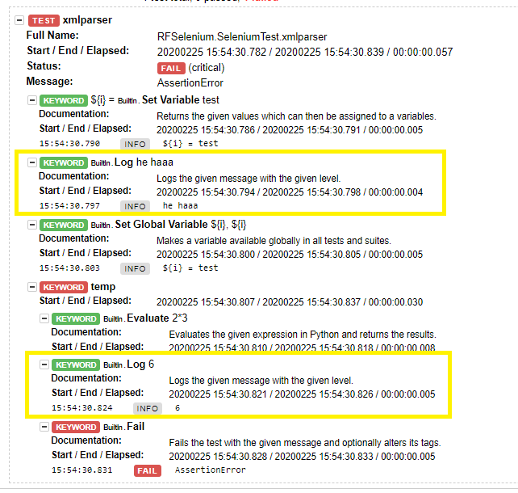
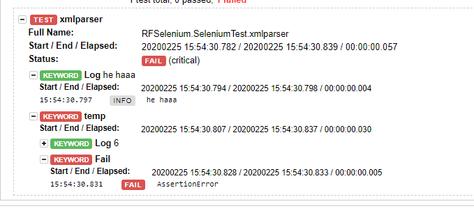

# RobotResultParser
RobotFramework output.xml parser to generate clean and only desired log traces. 

# What issue does this utility solves?
Sometimes it’s really hard to go through the RobotFramework logs and find out the meaningful traces to debug our test cases, Reason being RobotFramework logs every single step and we generally are not interested in every step but only a few specific ones.
To overcome this, I build this utility which allows you to extract only those informative log traces in very simple and quick steps.

# Pre-requisites:
Other than your robotframework setup you might need the Microsoft .Net framework runtime  

# How it works: 
It takes the RF generated output.xml file and will iterate through all the Suites/Tests/keywords to get only BuiltIn.Log or Failed keyword into consideration along with their parent keyword name. Rest of the keywords, which are passed, are ignored. It will act as substitute for the RF rebot command. But, it will not make any changes in the default robot output.xml file, and you will still be able to produce default log and report htmls via rebot command if the need be.

Therefore, while creating test cases, log the information explicitly, which you want to get in the parsed logs, via RF Log keyword in your test cases. Refer to the screenshots below to clarify.

# A quick demo reference:
Just to demonstrate the difference please refer the below given screenshots:

Rebot: log.html : Below given is the screenshot from the default RF reporting engine(rebot) which have log traces of every single steps. However, we might be interested only in the highlighted(in yellow) info.

 
 
RobotParser: 20150709-113747_LOG.html : Below given is the screenshot from the RobotXMLParser logs which have the only informative log traces and have removed all the unnecessary keywords & their details.

 
 
# Usage:
It is a console application and can be used in following two ways:

<b>1. By Double Clicking:</b> you can place the exe at the same location as your output.xml file and simply double click to run it. It should produce the Report and Log file with timestamp at the same location.

<b>2. By Command line:</b> If you wish to run it from a separate location (different than your output.xml file location) which could be the case if we are calling it from Jenkins or any other app. You need to pass the path of the xml as an argument and that should be it.

Eg: if your output.xml is at the location “D:\RF_Results”

You will need to call the exe along with argument <i>--path path_of_the_output.xml</i> file as shown below:
  
<b>RobotXMLParser.exe --path "D:\RF_Results"</b>
  
# Downloading the utility:
In order to get this utility, go to <i>RobotResultParser/Publish/</i> in this repository and download the <i>RobotXMLParser.exe</i> and you are all set to use it.

If you find it useful, please dont forget to give Star to my profile. It would definitely encourage me to build and share many other utils.

Thanks.
